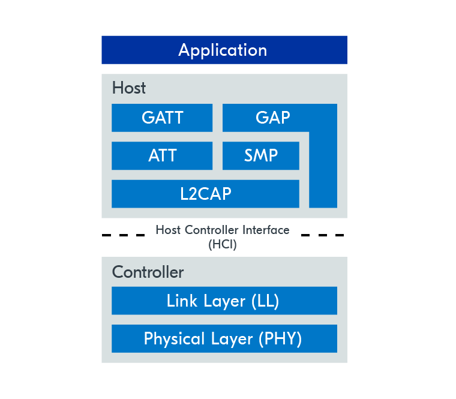

# The Bluetooth LE technology

The main objective of this document is to give a introduction about the Bluetooth
communication protocol, its stacks, layers and modules.

Document written by Matheus Souza <<mfbsouza.it@gmail.com>>

## Overview

Bluetooth can be simplified to two categories: Classic and LE.

Bluetooth Classic:

- Original version
- Communication works over Serial Port Profile (SPP), similar to a typical serial connection

Bluetooth Low Energy:

- Added in the Bluetooth specification 4.0
- Entirely different technology when compared to Classic
- Works according to the Client/Server principle

## The stack

The Bluetooth stack can be divided into two main parts: Controller and Host. The reason for
this is that the full Bluetooth technology could be implemented on separated chips, but since
IC technologies have evolved giving us faster and more powerful chips, in the vast majority of
cases this both parts are implemented on a single chip.

The Controller part of the stack is basically responsible for the radio hardware-related
aspects, such as controlling the transceiver, modulation, frequency channel selection and
others. The host part is the one who provides the actual Bluetooth implementation and it
communicates with the controller through a interface called Host Controller Interface (HCI).

### GATT - Generic Attribute Profile

As sad in the overview, Bluetooth LE works according to the Client/Server principle, so the GATT
implements a way to define what a given device can serve.

## References

- [Nordic Dev Academy: What is Bluetooth LE
    ](https://academy.nordicsemi.com/topic/what-is-bluetooth-le-2/)
- [WSN & IoT: Understanding Bluetooth Low Energy (BLE) - Theoretical Overview
    ](https://www.youtube.com/watch?v=GnRRutaqE5s)
